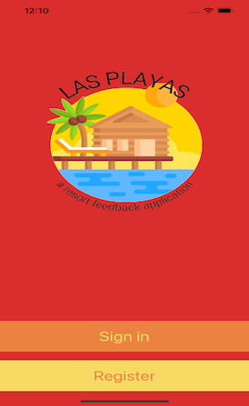
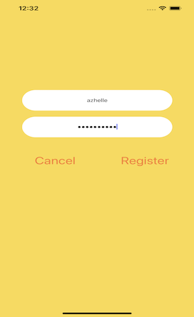
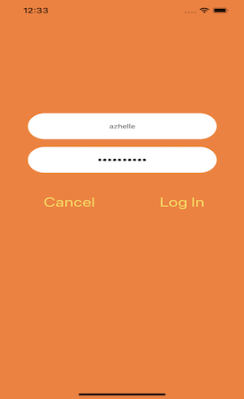
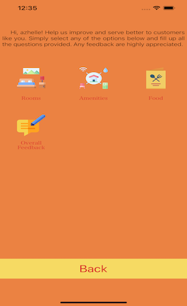
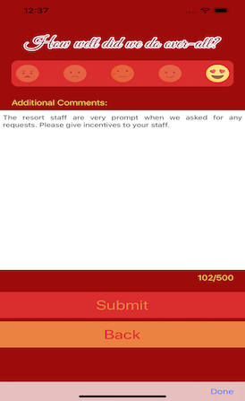

# Las-Playas: A Resort Feedback Application

## Project Description

This project is a single base application that allows the user to provide a feedback for the resort they stayed in.

## Technologies Used

1. XCode 13.3 - IDE
2. Swift 5 - Programming Language
3. CoreData - Database

## Features

List Of Features Ready:

* Sign Up / Log-In
* Add Rating (Rooms, Gym and Food)
* Add Over-All Feedback

TO-DO Features:

* View Rating
* Edit Ratings
* Delete Rating
* Settings
	* Change Username
	* Change Password
* Games

## Getting Started

1. All we need to do is to clone the project into your desired folder using the following command: ***git clone https://github.com/Chibi310/Las-Playas.git***.

2. Once cloning is done, switch to the Las-Playas folder and click on ***Las-Playas.xcodeproj***

3. Select "iPhone 13 Pro Max" as your simulator and click the Play button to start the application.

4. Voila, you can now start signing-up to play around with the application

## Usage

Below are screenshots of the project in action:

1. Welcome Page

2. Registration / Sign-Up Page

3. Login Page

4. Home Page

5. Survey Selection Page

6. Sample Survey Page - Food

7. Successful Submission Of Survey

8. Feedback Page

9. Successful Submission Of Feedback

## Contributors

<a href="https://github.com/Chibi310" title="Click for Github Portfolio">***Christopher Medina***</a>

<a href="https://github.com/scshockley03" title="Click for Github Portfolio">***Stanley Shockley***</a>

<a href="https://github.com/PabloDeLaCruz1" title="Click for Github Portfolio">***Pablo DeLa Cruz***</a>

<a href="https://github.com/azhelle16" title="Click for Github Portfolio">***Maricel Louise Sumulong***</a>

